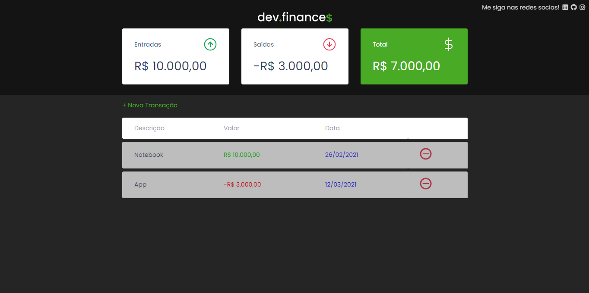
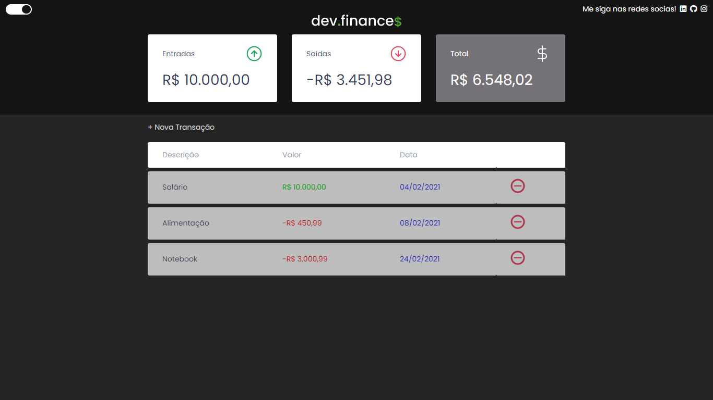

## Properties used in the application

- ###### Flexbox

- ###### Responsiveness

- ###### Semantic HTML

- <h6>Data storage in LocalStorage</h6>

<h2>Screenshot 1</h2>

    

<h2>Screenshot 2</h2>

    

<h2>Screenshot 3 (mobile)</h2>

    

