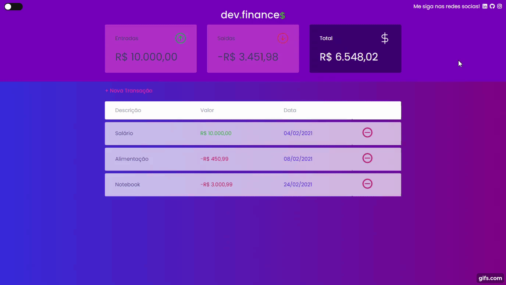

<h2>About the project</h2>

Dev.finances is a financial control application, where you can register and delete transactions and view the incoming and outgoing balance.

## Properties used in the application

- ###### Flexbox

- ###### Responsiveness

- ###### Semantic HTML

- <h6>Data storage in LocalStorage</h6>

- <h6>Sweetalert lib</h6>

  

<h2>Screenshot 1</h2>

    

<h2>Screenshot 2</h2>

    

